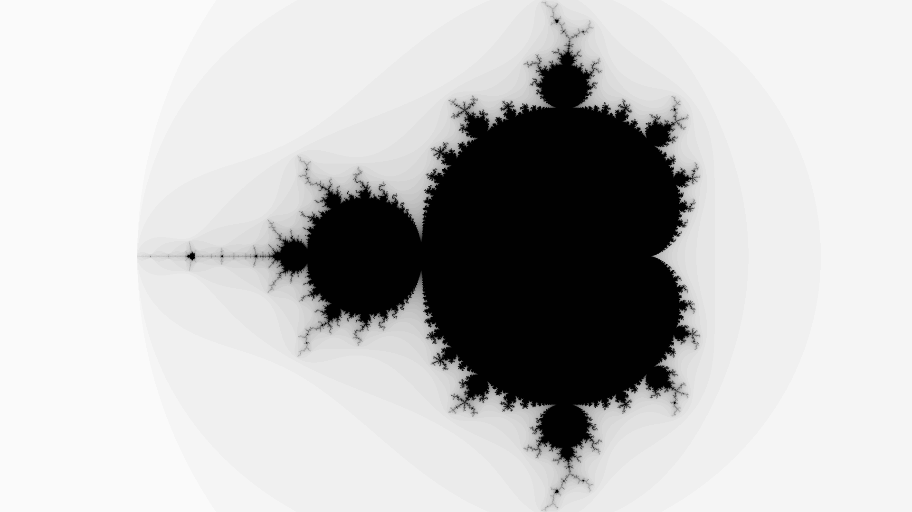
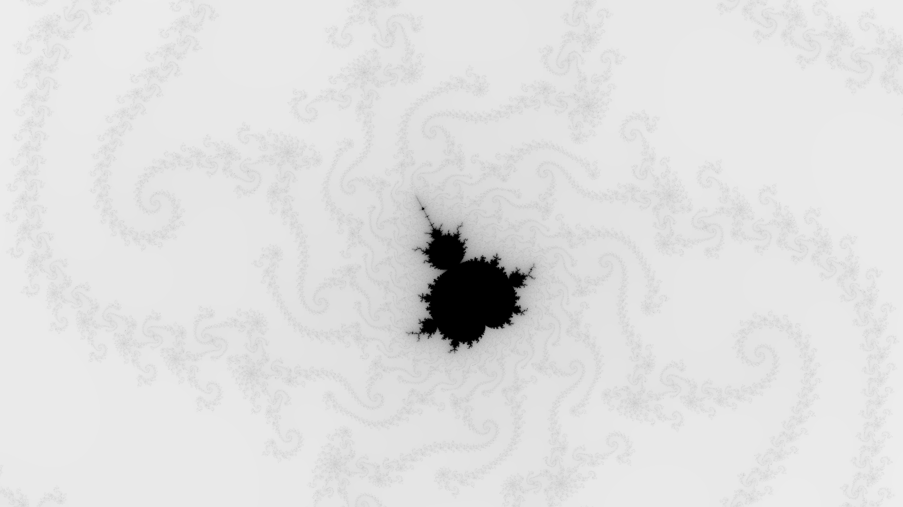

# Mandelbrot set drawer

This is a sample project to show very basic use of MPI. An image is generated, where each process writes part of the image.


### Usage
Run the executable with a single argument
```bash
# Run in serial
./bin/Release/mandelbrot [settings-file]

# Run with MPI
mpirun -np 4 ./bin/Release/mandelbrot demos/mandelbrot/data/mandelbrot.ini [settings-file]
```
Do not specify a file if you want to run the defaults. You can see an example settings file in `data/mandelbrot.ini`.
This will create a file with format NetPBM. Conversion to a reasonable image type is outside the scope of this project,
but you can use:

```bash
# Install netpbm package
sudo apt-get -y update && sudo apt-get -y install netpbm

# Convert file
pnmtopng output.ppm > image.png
```

Otherwise you can simply open the `ppm` image file with some image viewers or with Inkscape.

### Results

The default values produce the following image:



The sample settings file results producte the following image:



### Settings
The settings follow schema with the mentioned defauls:
```ini
; Real coordinate of the center of the image
center_real: -0.6       # float

; Imaginary coordinate of the center of the image
center_imag: 0.0        # float

; Width of the image in the complex plane
; The height is auto-adjusted with image aspect ratio
span:        4.0        # positive integer

; Width and heigh of the image, in pixels
img_width:   1920       # positive integer
img_height:  1080       # positive integer

; Maximum number of iterations per pixel
max_iter:    30         # positive integer

; Whether to print debug info or not
debug:       false      # [true|false]

; What file to write the image to
output:      output.ppm # string

; What format to store the image (NetPMB ascii or binary)
encoding:    binary     # [asccii|binary]
```
